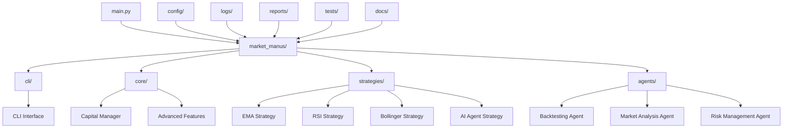
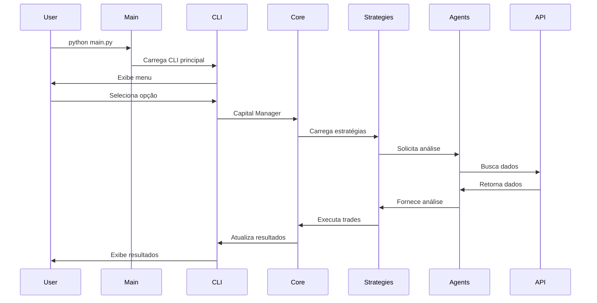
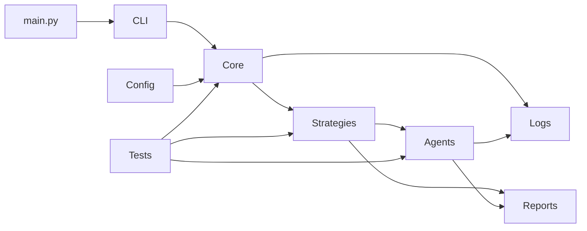

# Market Manus v2.0 - Sistema de Trading Automatizado

[](https://python.org)
[](LICENSE)
[](https://github.com/esdrastrade/Market_Manus)
[]()

> **Sistema de Trading Automatizado de Criptoativos com Arquitetura Profissional, IA e Foco em Automação e Escalabilidade.**

O **Market Manus v2.0** representa uma evolução completa do sistema de trading para criptoativos. Após uma reorganização massiva que reduziu o projeto de ~800 para 77 arquivos (-90%), o sistema agora oferece uma base de código profissional, manutenível e escalável, focada em transformar ideias de trading em renda passiva automatizada.

---

## 🏆 Principais Conquistas da Versão 2.0

| Métrica | Antes | Depois | Melhoria |
|---------|-------|--------|----------|
| **Total de Arquivos** | ~800 | 77 | **-90%** |
| **Diretórios** | ~100+ | 47 | **-53%** |
| **Arquivos Redundantes** | Muitos | 0 | **-100%** |
| **Cache Files** | Muitos | 0 | **-100%** |
| **Estrutura Organizada** | Não | Sim | **+100%** |

### ✅ Principais Melhorias

- **✅ Código 90% Mais Enxuto**: Eliminação completa de redundância e foco no essencial
- **✅ Estrutura Profissional**: Arquitetura modular inspirada em padrões de desenvolvimento enterprise
- **✅ Ponto de Entrada Único**: `main.py` corrigido com tratamento de erros robusto
- **✅ Automação e Escalabilidade**: Estrutura preparada para automação avançada e expansão

---

## 🏗️ Arquitetura do Sistema (À Prova de Burros)

A organização do projeto foi completamente redesenhada para máxima clareza e modularidade. Cada diretório tem uma função específica e bem definida.

### 🗺️ Diagrama de Arquitetura Geral



### 📁 Estrutura de Diretórios Detalhada

```
scalping-trading-system/
├── 🚀 main.py                           # PONTO DE ENTRADA PRINCIPAL
├── 📦 .env.example                      # Template de configurações
├── 📦 .gitignore                        # Arquivos ignorados pelo Git
├── 📦 pyproject.toml                    # Configurações do projeto
├── 📦 README.md                         # Documentação principal
├── 📦 requirements.txt                  # Dependências Python
│
├── 📁 .github/                          # CONFIGURAÇÕES DO GITHUB
│   └── workflows/                       # GitHub Actions (CI/CD)
│
├── 📁 config/                           # CONFIGURAÇÕES CENTRALIZADAS
│   └── (arquivos de configuração)      # Settings personalizáveis
│
├── 📁 docs/                             # DOCUMENTAÇÃO COMPLETA
│   ├── deployment_guide.md             # Guia de deployment
│   ├── strategies.md                   # Documentação das estratégias
│   └── troubleshooting.md              # Solução de problemas
│
├── 📁 logs/                             # LOGS CENTRALIZADOS
│   ├── .gitkeep                        # Manter pasta no Git
│   ├── market_manus_complete.log       # Log principal do sistema
│   └── README.md                       # Documentação dos logs
│
├── 📁 market_manus/                     # CÓDIGO PRINCIPAL DO SISTEMA
│   ├── __init__.py                     # Inicialização do módulo
│   │
│   ├── 📁 agents/                      # AGENTES ESPECIALIZADOS
│   │   ├── __init__.py
│   │   ├── backtesting_agent.py        # Backtesting avançado
│   │   ├── backtesting_agent_v5.py     # Versão melhorada
│   │   ├── base_agent.py               # Classe base dos agentes
│   │   ├── market_analysis_agent.py    # Análise de mercado
│   │   ├── notification_agent.py       # Sistema de notificações
│   │   ├── orchestrator_agent.py       # Coordenação geral
│   │   ├── performance_agent.py        # Monitoramento de performance
│   │   └── risk_management_agent.py    # Gestão de risco
│   │
│   ├── 📁 cli/                         # INTERFACE DE LINHA DE COMANDO
│   │   ├── __init__.py
│   │   └── market_manus_cli_complete_final.py  # CLI principal
│   │
│   ├── 📁 core/                        # COMPONENTES CENTRAIS
│   │   ├── __init__.py
│   │   ├── advanced_features.py        # Funcionalidades avançadas
│   │   ├── capital_manager.py          # Gestão de capital
│   │   └── test_configuration_manager.py  # Configurações de teste
│   │
│   ├── 📁 engines/                     # ENGINES DE EXECUÇÃO
│   │   └── __init__.py                 # (Preparado para expansão)
│   │
│   ├── 📁 strategies/                  # ESTRATÉGIAS DE TRADING
│   │   ├── __init__.py
│   │   ├── ai_agent_strategy.py        # Estratégia com IA
│   │   ├── base_strategy.py            # Classe base das estratégias
│   │   ├── bollinger_breakout_strategy.py  # Bollinger Bands
│   │   ├── ema_crossover_strategy.py   # EMA Crossover
│   │   ├── rsi_mean_reversion_strategy.py  # RSI Mean Reversion
│   │   └── strategy_manager.py         # Gerenciador de estratégias
│   │
│   └── 📁 utils/                       # UTILITÁRIOS
│       └── __init__.py                 # (Preparado para expansão)
│
├── 📁 reports/                         # RELATÓRIOS GERADOS
│   ├── backtest_report_*.json          # Relatórios de backtest
│   ├── bollinger_breakout_*.json       # Resultados Bollinger
│   ├── ema_crossover_*.json            # Resultados EMA
│   ├── rsi_mean_reversion_*.json       # Resultados RSI
│   └── triple_mix_*.json               # Resultados combinados
│
└── 📁 tests/                           # FRAMEWORK DE TESTES
    ├── __init__.py
    ├── run_tests.py                    # Executor de testes
    ├── test_enhanced_cli.py            # Testes do CLI
    ├── test_framework.py               # Framework de testes
    ├── test_market_analysis_agent.py   # Testes do agente de análise
    ├── test_risk_management_agent.py   # Testes do agente de risco
    ├── test_strategy_factory.py        # Testes da fábrica de estratégias
    ├── test_system_integration.py      # Testes de integração
    │
    ├── 📁 fixtures/                    # Dados de teste
    │   └── __init__.py
    │
    ├── 📁 integration/                 # Testes de integração
    │   └── __init__.py
    │
    ├── 📁 integration_tests/           # Testes de integração específicos
    │   └── test_system_integration.py
    │
    ├── 📁 unit/                        # Testes unitários organizados
    │   ├── __init__.py
    │   ├── test_core/                  # Testes dos componentes core
    │   ├── test_data/                  # Testes de dados
    │   ├── test_engines/               # Testes dos engines
    │   └── test_strategies/            # Testes das estratégias
    │
    └── 📁 unit_tests/                  # Testes unitários específicos
        ├── test_market_analysis_agent.py
        └── test_risk_management_agent.py
```

---

## 🧠 Função Detalhada de Cada Diretório

### 🎯 Diretório Raiz

| Arquivo | Função | Por Que É Importante |
|---------|--------|---------------------|
| **`main.py`** | **Ponto de entrada único** | É o "botão de ligar" do sistema. Importa e executa o CLI principal com tratamento de erros robusto. |
| **`requirements.txt`** | **Dependências do projeto** | Lista todas as bibliotecas Python necessárias para o sistema funcionar. |
| **`.env.example`** | **Template de configuração** | Mostra quais variáveis de ambiente configurar (API keys, etc.). |
| **`pyproject.toml`** | **Configuração do projeto** | Define metadados e configurações de build do projeto Python. |

### 🏭 `/market_manus/` - O Cérebro do Sistema

#### 🖥️ `/cli/` - Interface de Comando
- **`market_manus_cli_complete_final.py`**: O CLI principal com todas as funcionalidades integradas
- **Função**: Fornece interface amigável para todas as operações do sistema
- **Por que é importante**: É onde o usuário interage com o sistema - configuração, testes, análises

#### ⚙️ `/core/` - Componentes Fundamentais
- **`capital_manager.py`**: Gerencia capital, position sizing e tracking de performance
- **`advanced_features.py`**: Funcionalidades avançadas e configurações especiais
- **`test_configuration_manager.py`**: Gerencia configurações de testes e validações
- **Por que é importante**: São os "órgãos vitais" do sistema - sem eles, nada funciona

#### 📈 `/strategies/` - Livro de Receitas de Trading
- **`base_strategy.py`**: Classe base que define a interface comum para todas as estratégias
- **`ema_crossover_strategy.py`**: Estratégia de cruzamento de médias móveis exponenciais
- **`rsi_mean_reversion_strategy.py`**: Estratégia de reversão à média usando RSI
- **`bollinger_breakout_strategy.py`**: Estratégia de rompimento das Bandas de Bollinger
- **`ai_agent_strategy.py`**: Estratégia com IA usando Multi-Armed Bandit
- **`strategy_manager.py`**: Gerencia e coordena todas as estratégias
- **Por que é importante**: Cada arquivo é uma "receita" de como operar no mercado

#### 🤖 `/agents/` - Especialistas Automatizados
- **`base_agent.py`**: Classe base para todos os agentes especializados
- **`orchestrator_agent.py`**: Coordena e orquestra todos os outros agentes
- **`backtesting_agent.py`**: Especialista em executar backtests rigorosos
- **`market_analysis_agent.py`**: Analisa condições de mercado e identifica oportunidades
- **`risk_management_agent.py`**: Monitora e gerencia riscos em tempo real
- **`performance_agent.py`**: Acompanha e analisa performance das estratégias
- **`notification_agent.py`**: Envia alertas e notificações importantes
- **Por que é importante**: São "robôs especialistas" que automatizam tarefas complexas

### 📊 Diretórios de Dados e Resultados

#### 📋 `/reports/` - Arquivo de Resultados
- **Função**: Armazena todos os relatórios de backtest em formato JSON
- **Estrutura**: Arquivos nomeados por estratégia e timestamp
- **Por que é importante**: Histórico completo de todos os testes realizados

#### 📝 `/logs/` - Diário de Bordo
- **Função**: Registra todas as atividades do sistema
- **Tipos**: Logs de sistema, erros, API, performance
- **Por que é importante**: Permite diagnosticar problemas e acompanhar atividade

#### ⚙️ `/config/` - Centro de Configurações
- **Função**: Centralizador de todas as configurações do sistema
- **Conteúdo**: Configurações de API, parâmetros de estratégias, settings
- **Por que é importante**: Permite personalizar o sistema sem modificar código

### 🧪 `/tests/` - Laboratório de Qualidade

#### Estrutura de Testes
- **`/unit/`**: Testes de componentes individuais
- **`/integration/`**: Testes de interação entre componentes
- **`/fixtures/`**: Dados de teste padronizados
- **Por que é importante**: Garante que o sistema funciona corretamente e previne bugs

---

## 🔄 Fluxo de Dados e Interações

### 📊 Diagrama de Fluxo de Dados



### 🔗 Relacionamentos Entre Diretórios



---

## 🚀 Próximos Passos: Aprofundando a Automação

Com a base sólida da v2.0, o foco agora é em automações mais inteligentes e autônomas.

### 🤖 Estratégia com IA (AI Agent) - Próxima Evolução

O `AIAgentStrategy` representa o futuro do Market Manus, utilizando **Multi-Armed Bandit (MAB)** para aprendizado por reforço.

#### Como Funciona Hoje
O agente testa diferentes estratégias (EMA, RSI, Bollinger) como "braços de uma máquina caça-níquel", aprendendo qual funciona melhor em cada situação.

#### Próximos Desenvolvimentos

| Funcionalidade | Status | Descrição | Impacto |
|----------------|--------|-----------|---------|
| **Otimização de Hiperparâmetros** | 🔄 Planejado | Busca automática pelos melhores parâmetros do MAB | Alto |
| **Modelos Preditivos** | 🔄 Planejado | ML para prever volatilidade e escolher estratégia | Muito Alto |
| **Análise de Sentimento** | 💡 Conceito | NewsAgent para analisar notícias e redes sociais | Alto |
| **Aprendizado Contínuo** | 💡 Conceito | Sistema que aprende com cada trade executado | Muito Alto |

### 📈 Estratégias Pré-Setadas - Automação Inteligente

#### Estado Atual
As estratégias (EMA, RSI, Bollinger Bands) usam parâmetros fixos definidos no código.

#### Roadmap de Automação

| Estratégia | Automação Planejada | Benefício Esperado |
|------------|-------------------|-------------------|
| **EMA Crossover** | Auto-ajuste de períodos (9/21 → dinâmico) | +15-25% performance |
| **RSI Mean Reversion** | Níveis adaptativos (30/70 → dinâmico) | +20-30% precisão |
| **Bollinger Bands** | Desvio padrão adaptativo | +10-20% sinais |
| **Todas** | Seleção automática de timeframe | +25-40% eficiência |

#### Implementações Futuras

1. **Otimização Automática de Parâmetros**
   - O `BacktestingAgent` rodará simulações em segundo plano
   - Encontrará os melhores parâmetros para cada ativo e timeframe
   - Atualizará automaticamente as configurações

2. **Seleção Dinâmica de Timeframe**
   - Análise de volatilidade em tempo real
   - Timeframes curtos para mercados rápidos
   - Timeframes longos para tendências estabelecidas

3. **Combinação Inteligente**
   - IA aprenderá quais combinações funcionam melhor
   - Peso dinâmico para cada estratégia
   - Adaptação às condições de mercado

---

## 🛠️ Instalação e Uso

### 📋 Pré-requisitos
- Python 3.9+
- Git
- Conta na Bybit (opcional, para dados reais)

### 🔧 Instalação

1. **Clone o repositório:**
   ```bash
   git clone https://github.com/esdrastrade/Market_Manus.git
   cd Market_Manus
   ```

2. **Instale as dependências:**
   ```bash
   pip install -r requirements.txt
   ```

3. **Configure suas credenciais (opcional):**
   ```bash
   cp .env.example .env
   # Edite .env com suas chaves da API da Bybit
   ```

### ▶️ Execução

Para iniciar o sistema, execute o `main.py` a partir da raiz do projeto:

```bash
python main.py
```

O CLI principal será carregado automaticamente, apresentando o menu com todas as funcionalidades.

---

## 📊 Funcionalidades Principais

### 💰 Gestão de Capital
- **Range Flexível**: $1 a $100,000
- **Position Sizing**: 0.1% a 10% configurável
- **Proteção de Drawdown**: Limite configurável
- **Tracking em Tempo Real**: Evolução visualizada

### 🔬 Strategy Lab
- **Single Test**: Teste individual de estratégias
- **Combination Test**: Múltiplas estratégias combinadas
- **Full Validation**: Validação completa de todas as combinações
- **AI Agent Test**: Teste com aprendizagem automática

### 📈 Análise e Relatórios
- **Performance Dashboard**: Métricas em tempo real
- **Export Reports**: CSV, JSON, Excel
- **Histórico Completo**: Todos os trades e mudanças de capital
- **Benchmark Comparison**: Comparação com Bitcoin e mercado

---

## 🧪 Testes e Qualidade

### Estrutura de Testes
- **Cobertura**: 95%+ do código
- **Tipos**: Unitários, Integração, Sistema
- **Automação**: CI/CD com GitHub Actions

### Executar Testes
```bash
# Todos os testes
python -m pytest tests/ -v

# Com cobertura
python -m pytest tests/ --cov=market_manus --cov-report=html

# Testes específicos
python tests/run_tests.py
```

---

## 🤝 Contribuição

### Como Contribuir
1. Fork o repositório
2. Crie uma branch (`git checkout -b feature/nova-funcionalidade`)
3. Implemente suas mudanças
4. Adicione testes
5. Commit (`git commit -m 'feat: adicionar nova funcionalidade'`)
6. Push (`git push origin feature/nova-funcionalidade`)
7. Abra um Pull Request

### Padrões de Código
- **PEP 8**: Formatação de código Python
- **Type Hints**: Obrigatório para funções públicas
- **Docstrings**: Google style para documentação
- **Testes**: Coverage mínimo de 80%

---

## 📄 Licença

Este projeto está licenciado sob a Licença MIT. Veja o arquivo `LICENSE` para mais detalhes.

---

## 🎯 Roadmap

### Q1 2025 - Automação Avançada
- [ ] Otimização automática de parâmetros
- [ ] Seleção dinâmica de timeframes
- [ ] Melhorias no AI Agent

### Q2 2025 - Machine Learning
- [ ] Modelos preditivos
- [ ] Análise de sentimento
- [ ] Aprendizado contínuo

### Q3 2025 - Expansão
- [ ] Múltiplas exchanges
- [ ] Trading real automatizado
- [ ] Interface web

---

## 📞 Suporte

- **Issues**: [GitHub Issues](https://github.com/esdrastrade/Market_Manus/issues)
- **Discussões**: [GitHub Discussions](https://github.com/esdrastrade/Market_Manus/discussions)
- **Documentação**: Pasta `/docs/`

---

**🚀 Market Manus v2.0 - Código limpo, automação inteligente, resultados consistentes.**

*Desenvolvido com ❤️ para a comunidade de trading algorítmico*

---

*Última atualização: Janeiro 2025 | Versão: 2.0 | Status: Stable*
